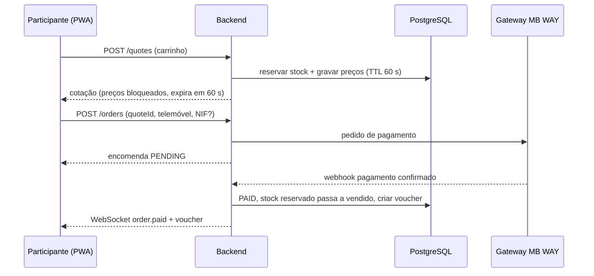
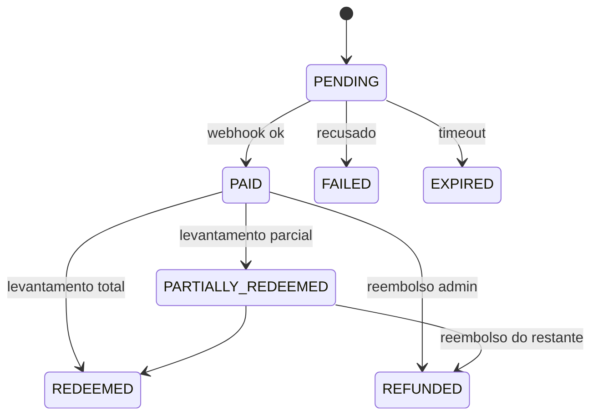
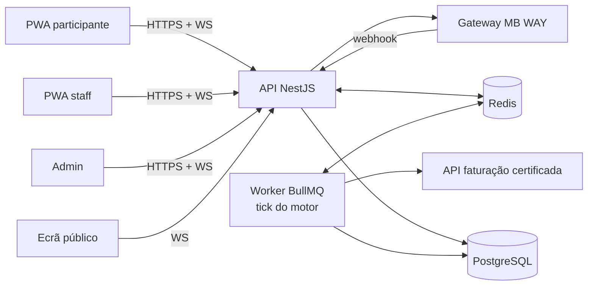

# Bolsa de Bebidas — Especificação Técnica para Implementação

2026-09-17 · @Someone

## 0. Instruções para o Claude (programação)

Este documento é a especificação de uma plataforma web mobile-first de "bolsa de bebidas" para festas em Portugal. O teu papel é arquiteto e engenheiro de software sénior: implementar a plataforma por fases, com código testável e pronto para produção.

Regras de trabalho:

1. Lê o documento inteiro antes de escrever código. Se algo estiver ambíguo, lista as dúvidas e propõe uma decisão por defeito.
2. Segue a ordem do roadmap (secção 14). Começa pelo motor de preços como biblioteca pura, com testes, antes de qualquer interface.
3. Os requisitos da secção 2 (legais) são restrições rígidas, não sugestões. Nenhuma funcionalidade pode violá-los.
4. Dinheiro é sempre inteiro em cêntimos de euro. Nunca usar floats para valores monetários.
5. Interface em português de Portugal (pt-PT), com estrutura pronta para inglês.
6. Pagamentos e faturação ficam atrás de interfaces (adapters), com implementação Mock para desenvolvimento.
7. No fim de cada fase: resumo do que foi feito, como correr, testes a passar e o que falta.

## 1. Visão geral do produto

Os preços das bebidas variam em tempo real conforme a procura, como numa bolsa, sempre dentro de um intervalo mínimo–máximo fixo por bebida. Se o fino vende muito, o preço do fino sobe e os substitutos (ex.: cidra) descem.

Como funciona para o participante:

- Lê um QR Code no local e abre uma PWA no telemóvel, sem instalar nada.
- Vê as cotações ao vivo, compra e paga pela app a qualquer momento.
- Recebe um voucher QR e levanta a bebida no bar quando quiser, até ao fim do evento.

Componentes do sistema:

| Componente | Utilizador | Função |
| --- | --- | --- |
| App do participante (PWA) | Público | Mercado, compra, vouchers, ranking |
| App de staff (PWA, rota /staff) | Empregados do bar | Ler voucher QR, validar, confirmar idade, marcar como levantado |
| Painel de administração (rota /admin) | Organizador | Produtos, stock, parâmetros do mercado, controlo do evento, relatórios |
| Ecrã público (rota /screen) | Ecrã grande no local | Ticker de cotações e tabela de preços mínimo–máximo |
| Backend + motor de preços | Sistema | Encomendas, stock, pagamentos, vouchers, atualização periódica de preços |

Fora do âmbito do MVP: apps nativas iOS/Android, múltiplos eventos em simultâneo com contas partilhadas, programa de fidelização entre eventos.

## 2. Requisitos legais como requisitos de software (Portugal)

Cada linha abaixo é uma restrição obrigatória de implementação. O enquadramento deve ser confirmado por jurista antes do evento real; o software deve ser configurável para acomodar ajustes.

| ID | Base | Requisito de software |
| --- | --- | --- |
| L1 | Transparência de preço (lei do consumidor; posição da DECO sobre preços dinâmicos) | O preço mostrado no checkout fica bloqueado durante a validade da cotação (default 60 s). O valor cobrado é sempre igual ao valor mostrado. |
| L2 | Afixação de preços (DL 138/90; DL 10/2015, art. 135.º) | Cada produto tem preço mínimo e máximo visíveis na app e no ecrã público. Rota /prices imprimível com a tabela mínimo–máximo. |
| L3 | Regras de anúncio de reduções de preço (DL 109-G/2021) | Nunca usar as palavras "promoção", "desconto", "saldo" ou percentagens de desconto. Usar "cotação" e "variação". |
| L4 | Publicidade a bebidas alcoólicas (Código da Publicidade, art. 17.º) | Proibido qualquer ranking, badge ou mensagem que premeie quantidade consumida. O ranking mede qualidade de compra (secção 4.6). |
| L5 | Venda de álcool proibida a menores de 18 anos | Autodeclaração 18+ no registo. Na app de staff, encomendas com álcool mostram aviso "Verificar identificação" e exigem confirmação explícita. |
| L6 | Faturação com programa certificado pela AT (Portaria 363/2010) | Cada pagamento gera documento fiscal via API de software certificado (adapter InvoicingProvider). Pedido de NIF opcional no checkout. |
| L7 | RGPD | Recolha mínima: nickname, telemóvel só para pagamento, NIF opcional. Ranking opt-in. Política de privacidade e prazo de retenção configurável. Alojamento na UE. |
| L8 | Consumo responsável | Limite configurável de unidades alcoólicas por participante por janela de tempo (default 4 por 30 min). Água sempre disponível e listada no mercado. |

Recomendação de negócio (confirmar com jurista): preço mínimo de cada produto maior ou igual ao custo unitário, para não haver venda abaixo do custo.

## 3. Atores e perfis

Quatro perfis com permissões separadas por role (RBAC).

| Perfil | Autenticação | Pode | Não pode |
| --- | --- | --- | --- |
| Participante | Sessão anónima (cookie httpOnly) criada ao ler o QR; nickname + declaração 18+ | Ver mercado, comprar, ver os seus vouchers, ver ranking, sair do ranking | Ver dados de outros participantes além do nickname no ranking |
| Staff | Email + password (argon2), role STAFF, associado a um ponto de levantamento | Ler QR, ver itens do voucher, confirmar idade, marcar levantamento, reportar problema | Alterar preços, stock ou encomendas |
| Admin | Email + password + 2FA (TOTP), role ADMIN | Gerir evento, produtos, stock, parâmetros, pausar mercado, reembolsos, relatórios | Alterar preços fora do intervalo mínimo–máximo |
| Ecrã público | Token de leitura na URL, role SCREEN | Receber cotações em tempo real | Qualquer escrita |

## 4. Requisitos funcionais por módulo

### 4.1 Evento

- Estados: DRAFT → OPEN (mercado a funcionar) → PAUSED (preços congelados, compras permitidas) → CLOSED\_SALES (sem compras, levantamentos permitidos) → FINISHED.
- Botão de emergência "preços fixos": todos os produtos voltam ao preço base e o motor para.
- Configuração: nome, datas, fuso horário Europe/Lisbon, parâmetros do motor, limites de compra, textos legais.

### 4.2 Produtos e stock

- Campos: nome, categoria, grupo de substituição, contém álcool (sim/não), volume (ml), custo, preço base, preço mínimo, preço máximo, stock inicial, imagem, ordem de apresentação.
- Validação: mínimo ≤ base ≤ máximo; mínimo ≥ custo (aviso, não bloqueio).
- Importação e exportação por CSV.
- Stock com três contadores: disponível, reservado (checkout em curso), vendido. O stock nunca fica negativo.
- Quando o disponível chega a 0, o produto aparece como "Esgotado" e sai do cálculo do motor.
- Ajuste manual de stock com motivo obrigatório, registado em auditoria.

### 4.3 Mercado (participante)

- Lista de produtos com: preço atual, seta e variação face ao preço base, mini-gráfico da última hora, intervalo mínimo–máximo, estado de stock.
- Atualização por WebSocket a cada tick; animação discreta ao mudar.
- Filtro por categoria e opção "sem álcool".

### 4.4 Compra

- Carrinho com vários produtos e quantidades.
- Limite por produto por encomenda (default 4) e limite de álcool por janela (L8).
- "Pagar" cria uma cotação: preços bloqueados e stock reservado por 60 s, com contagem decrescente visível.
- Se a cotação expirar, o carrinho mantém-se e o utilizador vê os novos preços antes de confirmar.
- Pagamento por MB WAY (número de telemóvel → confirmação na app MB WAY). Estados: PENDING → PAID | FAILED | EXPIRED.
- A reserva de stock dura enquanto o pagamento está PENDING (timeout configurável, default 4 min).

### 4.5 Vouchers e levantamento

- Um voucher por encomenda paga, com QR assinado e código curto legível (6 caracteres) como alternativa.
- Levantamento total ou parcial por item; o voucher guarda quantidades levantadas.
- Válido até ao estado FINISHED do evento.
- App de staff: câmara lê QR → mostra itens, nickname e aviso de idade se houver álcool → botão "Entregar" → estado atualizado em tempo real no telemóvel do participante.
- Reembolso de vouchers não levantados feito pelo admin, com política definida antes do evento.

### 4.6 Ranking "Melhor Trader"

- Mede a qualidade das compras, não a quantidade (L4).
- Pontuação por unidade: poupança relativa u = (preço base − preço pago) / preço base.
- Pontuação do participante: média de u sobre as unidades compradas, contando no máximo 10 unidades (as primeiras).
- Mínimo de 2 unidades para aparecer no ranking. Produtos sem álcool contam igual.
- Mostra: posição, nickname, pontuação em pontos (u × 1000, arredondado). Nunca mostra quantidades nem valor gasto.
- Opt-in no registo; o participante pode sair a qualquer momento.
- Ranking por equipas opcional (código de equipa no registo), com a mesma métrica.

### 4.7 Administração

- Dashboard ao vivo: vendas por produto, receita, stock, preço de cada produto ao longo do tempo, encomendas pendentes.
- Controlo: iniciar, pausar, retomar, fechar vendas, terminar; ajustar parâmetros do motor com efeito no tick seguinte.
- Override manual do preço de um produto dentro do intervalo, com duração definida.
- Relatórios exportáveis (CSV): vendas, histórico de preços, levantamentos, reembolsos.
- Log de auditoria de todas as ações de admin e staff.

### 4.8 Ecrã público

- Layout de ticker de bolsa em ecrã horizontal, tema escuro, fontes grandes.
- Mostra preço atual, variação, intervalo mínimo–máximo e QR Code de entrada.
- Top 5 do ranking opcional.
- Reconexão automática; se perder ligação, mostra "a atualizar" e nunca preços antigos sem aviso.

## 5. Motor de preços

O motor é uma função pura e determinística executada a cada tick (default 120 s): recebe o estado anterior e as vendas do tick, devolve os novos preços. Deve viver num pacote isolado (`packages/pricing-engine`) sem dependências de base de dados ou rede.

### 5.1 Princípios

- Procura acima do esperado sobe o preço; abaixo do esperado desce.
- Produtos do mesmo grupo de substituição competem entre si (ex.: grupo "cerveja e cidra": fino, imperial, cidra).
- O preço médio ponderado de cada grupo mantém-se perto do preço base médio, para a receita não depender do acaso.
- Reversão à média: sem vendas, o preço regressa lentamente ao preço base.
- Stock baixo empurra o preço para cima.
- Limites rígidos: p\_min ≤ p ≤ p\_max, sempre, em todas as circunstâncias.
- Variação máxima por tick, para evitar saltos bruscos.
- Só vendas com pagamento confirmado (PAID) entram no cálculo.

### 5.2 Parâmetros

| Símbolo | Nome no código | Default | Significado |
| --- | --- | --- | --- |
| T | tickSeconds | 120 | Intervalo entre atualizações |
| λ | ewmaLambda | 0.5 | Peso das vendas do tick na procura suavizada |
| α | demandSensitivity | 0.10 | Força da resposta à procura |
| β | meanReversion | 0.05 | Força do regresso ao preço base |
| γ | stockPressure | 0.05 | Força do efeito de stock baixo |
| θ | lowStockThreshold | 0.20 | Fração de stock abaixo da qual há pressão |
| δ | maxStepPct | 0.08 | Variação máxima por tick (±8%) |
| step | roundingCents | 10 | Arredondamento do preço (0,10 €) |
| renormalize | renormalize | true | Manter preço médio do grupo |

### 5.3 Cálculo por tick, para cada grupo g

Para cada produto i ativo (não esgotado) do grupo:

1. q\_i = unidades pagas no tick.
2. Procura suavizada: d\_i ← λ·q\_i + (1 − λ)·d\_i.
3. Quota observada: s\_i = d\_i / Σ\_g d\_j. Se Σ\_g d\_j = 0, então s\_i = ŝ\_i.
4. Quota esperada ŝ\_i: configurável por produto; default 1/n\_g (n\_g = produtos ativos no grupo).
5. Sinal de procura: x\_i = clip((s\_i − ŝ\_i) / ŝ\_i, −1, 1).
6. Desvio do base: r\_i = (p\_i − p0\_i) / p0\_i.
7. Sinal de stock: a\_i = disponível / inicial; k\_i = max(0, θ − a\_i) / θ.
8. Variação: Δ\_i = clip(α·x\_i − β·r\_i + γ·k\_i, −δ, +δ).
9. Preço candidato: p̃\_i = p\_i · (1 + Δ\_i).
10. Renormalização (se ativa): pesos w\_i = d\_i + ε (ε = 0.1). Fator c = (Σ w\_i·p0\_i) / (Σ w\_i·p̃\_i). Aplicar p̃\_i ← c·p̃\_i e cortar em \[p\_min, p\_max\]. Repetir até 5 iterações ou até |c − 1| < 0.001.
11. Após a renormalização, garantir de novo que |p̃\_i / p\_i − 1| ≤ δ.
12. Arredondar ao múltiplo de `roundingCents` mais próximo e voltar a garantir os limites (arredondar para dentro do intervalo).

O passo 10 implementa o exemplo pedido: se o fino vende muito, sobe; o preço médio do grupo sobe; o fator c < 1 empurra os restantes produtos do grupo (ex.: cidra) para baixo.

### 5.4 Interface (TypeScript)

```ts
type Cents = number; // inteiro

interface ProductState {
  productId: string;
  groupId: string;
  basePrice: Cents; minPrice: Cents; maxPrice: Cents;
  currentPrice: Cents;
  smoothedDemand: number;
  expectedShare?: number;
  stockInitial: number; stockAvailable: number;
  active: boolean;
  manualOverride?: { price: Cents; untilTick: number };
}

interface TickInput {
  tick: number;
  params: EngineParams;
  products: ProductState[];
  paidUnits: Record<string, number>; // productId -> unidades pagas no tick
}

interface TickOutput {
  tick: number;
  products: ProductState[]; // novo estado
  explain: Record<string, { x: number; r: number; k: number; delta: number; c: number }>;
}

function runTick(input: TickInput): TickOutput;
```

O campo `explain` guarda os sinais de cada produto em cada tick, para depuração, dashboard e análise científica posterior.

### 5.5 Invariantes a testar (property-based, fast-check)

- Para quaisquer entradas válidas: p\_min ≤ p ≤ p\_max em todos os produtos.
- |p\_novo / p\_antigo − 1| ≤ δ (tolerância de arredondamento de 1 step).
- Todos os preços são inteiros múltiplos de `roundingCents`, salvo quando o limite não é múltiplo.
- Sem vendas durante muitos ticks, os preços convergem para o preço base.
- Mesma entrada produz sempre a mesma saída (determinismo).
- Override manual respeita os limites e expira no tick definido.

### 5.6 Vetores de teste partilhados

Guardar em `packages/pricing-engine/test-vectors/*.json` cenários de entrada e saída esperada (ex.: "fino domina 3 ticks", "stock de cidra a 10%", "festa parada"). Os mesmos ficheiros são usados pelo simulador em Python (secção 13), garantindo que a implementação de investigação e a de produção dão os mesmos resultados.

### 5.7 Evento "crash" (opcional, desligado por defeito)

- Admin dispara uma descida temporária de um grupo durante 1 tick.
- Só pode ser aplicado a grupos sem álcool, e nunca abaixo de p\_min.
- Texto no ecrã: "Queda de mercado", nunca "promoção" (L3).

## 6. Fluxos principais

### 6.1 Compra e pagamento



O sistema responde ao webhook de forma idempotente (chave = referência do pagamento). Se o webhook não chegar, um job consulta o estado no gateway a cada 15 s até ao timeout.

### 6.2 Estados da encomenda



FAILED e EXPIRED libertam o stock reservado de imediato.

### 6.3 Levantamento no bar

1. Participante abre o voucher; o ecrã sobe o brilho e mostra o QR em ecrã inteiro.
2. Staff lê o QR na app /staff.
3. Backend verifica assinatura, evento e estado; devolve itens pendentes.
4. Se houver álcool, a app mostra "Verificar identificação (18+)" e exige toque de confirmação.
5. Staff seleciona itens entregues e confirma.
6. Backend atualiza de forma atómica: `UPDATE ... WHERE redeemed_qty + :q <= qty`. Se falhar, mostra "Já levantado" com hora e ponto de levantamento.
7. Telemóvel do participante recebe `voucher.updated` por WebSocket.

### 6.4 Casos de erro obrigatórios

| Situação | Comportamento |
| --- | --- |
| Cotação expira antes de pagar | Novo pedido de cotação com preços atuais; utilizador confirma de novo |
| Stock insuficiente ao cotar | Recusa com quantidade máxima disponível |
| Pagamento confirmado após expiração da reserva | Se houver stock, aceitar; senão reembolso automático e aviso |
| Voucher já levantado | Mensagem clara na app de staff com hora e ponto |
| QR inválido ou de outro evento | Recusa sem revelar detalhes internos |
| Participante perde a sessão | Recuperar vouchers pelo número de telemóvel usado no pagamento + código enviado |

## 7. Stack tecnológica recomendada

Recomendação: TypeScript em todo o produto (frontend, backend, motor de preços), PostgreSQL como base de dados, Redis para tempo real, e Python apenas para simulação e investigação. Uma só linguagem permite partilhar tipos e validações entre cliente e servidor, o que reduz erros em preços e dinheiro.

| Camada | Tecnologia | Porquê |
| --- | --- | --- |
| Linguagem | TypeScript (modo strict) | Tipos partilhados entre front e back; um só ecossistema |
| Monorepo | pnpm workspaces + Turborepo | Pacotes partilhados (tipos, schemas, motor) com builds rápidos |
| Frontend | React + Vite + vite-plugin-pwa | PWA instalável sem loja; arranque rápido no telemóvel |
| Estado e dados no cliente | TanStack Query + Zustand | Cache de API simples; estado local leve |
| UI | Tailwind CSS + componentes próprios | Controlo total do design mobile e tema escuro |
| Leitura de QR (staff) | @zxing/browser | Leitura pela câmara no browser, sem app nativa |
| Backend | Node.js LTS + NestJS | Estrutura modular, injeção de dependências, gateway WebSocket integrado, bom suporte a testes |
| Validação | Zod (schemas partilhados) | Mesma validação no cliente e no servidor |
| Tempo real | Socket.IO + Redis adapter | Reconexão automática; escala para várias instâncias |
| Base de dados | PostgreSQL 16 | Transações ACID para stock, encomendas e dinheiro |
| ORM e migrações | Prisma | Migrações versionadas e tipos gerados |
| Cache, pub/sub, rate limit | Redis 7 (ou Valkey) | Contadores em tempo real, locks, limites por participante |
| Jobs agendados | BullMQ | Tick do motor, expiração de reservas, polling de pagamentos, reenvio de webhooks |
| Autenticação | Cookie httpOnly (participante); argon2 + TOTP (staff/admin) | Sessão sem fricção para o público; segurança forte para quem gere |
| Pagamentos | Interface `PaymentProvider` + adapter para gateway português com MB WAY + `MockPaymentProvider` | Trocar de gateway sem mexer no domínio |
| Faturação | Interface `InvoicingProvider` + adapter para API de software certificado AT + mock | Cumprir L6 sem certificar software próprio |
| Infraestrutura | Docker Compose; VPS na UE; Caddy (HTTPS automático) | Deploy simples e barato para eventos |
| Testes | Vitest, fast-check, Playwright, k6 | Unitários, propriedades, end-to-end, carga |
| Observabilidade | pino (logs JSON), Sentry opcional, métricas Prometheus | Diagnóstico durante a festa |
| Simulação e investigação | Python 3.12 + NumPy + pandas + Mesa | Simulação baseada em agentes do motor de preços, análise para a tese |

Alternativa válida: backend em Python (FastAPI) + frontend em SvelteKit. Ganha-se proximidade ao ecossistema científico, mas perde-se a partilha direta de tipos. A escolha principal fica TypeScript; a investigação usa Python com os vetores de teste partilhados (5.6).

A escolha concreta do gateway MB WAY e do software de faturação certificado deve ser decidida comparando comissões, qualidade da API e ambiente de testes (sandbox).

## 8. Arquitetura do sistema

Monólito modular (um backend NestJS com módulos bem separados) + um worker para jobs. Microserviços não se justificam para esta escala.



O worker executa o tick, grava os preços e publica no Redis; a API reencaminha para os clientes ligados.

### 8.1 Estrutura do repositório

```text
bolsa-bebidas/
  apps/
    web/            # PWA: rotas /, /staff, /admin, /screen, /prices
    api/            # NestJS
    worker/         # BullMQ: tick, expirações, pagamentos, faturação
  packages/
    pricing-engine/ # função pura runTick + test-vectors
    shared/         # tipos, schemas Zod, constantes, formatação de cêntimos
    ui/             # componentes React partilhados
  research/
    simulator/      # Python: simulação baseada em agentes
  infra/
    docker-compose.yml
    Caddyfile
```

### 8.2 Módulos do backend

| Módulo | Responsabilidade |
| --- | --- |
| events | Ciclo de vida do evento e parâmetros |
| catalog | Produtos, grupos, preços mínimo–máximo |
| inventory | Stock disponível, reservado, vendido; operações atómicas |
| market | Estado de preços, histórico, publicação de ticks |
| quotes | Cotações com preço bloqueado e reserva |
| orders | Encomendas e máquina de estados |
| payments | PaymentProvider, webhooks idempotentes |
| vouchers | Emissão, assinatura, levantamento |
| leaderboard | Cálculo do ranking "Melhor Trader" |
| invoicing | InvoicingProvider, fila de emissão com retentativas |
| auth | Sessões, roles, 2FA |
| audit | Registo imutável de ações |
| realtime | Gateway Socket.IO, salas por evento e por participante |

### 8.3 Tempo real e consistência

- Salas Socket.IO: `event:{id}` (cotações), `participant:{id}` (encomendas e vouchers), `staff:{eventId}`, `admin:{eventId}`.
- Cada tick tem número sequencial; o cliente ignora ticks mais antigos que o último recebido.
- Ao reconectar, o cliente pede `GET /market/snapshot` para não ficar com preços antigos.
- Um lock no Redis garante que só um worker executa o tick de cada evento.
- O stock é alterado apenas em transações PostgreSQL com condição (`WHERE available >= :q`); o Redis serve de cache, nunca de fonte de verdade para dinheiro ou stock.

### 8.4 Rede no local da festa

A rede móvel fica muitas vezes congestionada em eventos com muita gente. Requisitos:

- Wi-Fi dedicado com rede aberta para o público e rede separada para staff, com ligação de backup 4G/5G.
- PWA com service worker: a app abre e mostra os vouchers já emitidos mesmo sem rede (vouchers guardados em IndexedDB).
- A app de staff valida a assinatura do QR localmente, mas o levantamento só é confirmado com o servidor. Modo offline de staff fica fora do MVP, porque vários leitores sem ligação permitem levantar o mesmo voucher duas vezes.

## 9. Modelo de dados

Todas as tabelas têm `id` (UUID v7), `created_at` e `updated_at`. Valores monetários em `integer` (cêntimos). Datas em `timestamptz`.

| Tabela | Campos principais | Notas |
| --- | --- | --- |
| events | name, status, timezone, engine\_params (jsonb), limits (jsonb), starts\_at, ends\_at | engine\_params com versão |
| product\_groups | event\_id, name | Grupos de substituição |
| products | event\_id, group\_id, name, category, is\_alcoholic, volume\_ml, cost\_cents, base\_price\_cents, min\_price\_cents, max\_price\_cents, stock\_initial, stock\_available, stock\_reserved, stock\_sold, sort\_order, image\_url | CHECK min ≤ base ≤ max; CHECK stock ≥ 0 |
| product\_engine\_state | product\_id, current\_price\_cents, smoothed\_demand, expected\_share, override\_price\_cents, override\_until\_tick | Estado do motor |
| price\_ticks | event\_id, tick, product\_id, price\_cents, paid\_units, explain (jsonb) | Histórico completo; índice (event\_id, tick) |
| participants | event\_id, nickname, is\_adult\_declared, leaderboard\_opt\_in, team\_code, phone\_hash, session\_id | Telemóvel guardado só como hash para recuperação |
| quotes | participant\_id, items (jsonb com preço bloqueado), total\_cents, expires\_at, status | Reserva de stock ligada |
| orders | participant\_id, quote\_id, status, total\_cents, nif (nullable), payment\_ref | Máquina de estados da secção 6.2 |
| order\_items | order\_id, product\_id, qty, unit\_price\_cents, base\_price\_cents\_at\_purchase, redeemed\_qty | base\_price guardado para o ranking |
| payments | order\_id, provider, provider\_ref (unique), status, raw\_payload (jsonb), received\_at | Idempotência por provider\_ref |
| vouchers | order\_id, short\_code (unique por evento), signature, status | QR = id + assinatura |
| redemptions | voucher\_id, order\_item\_id, qty, staff\_user\_id, pickup\_point, age\_checked | Uma linha por entrega |
| refunds | order\_id, amount\_cents, reason, admin\_user\_id, provider\_ref |  |
| invoices | order\_id, provider, document\_number, status, attempts, last\_error | Fila com retentativas |
| staff\_users | email, password\_hash, role, totp\_secret, pickup\_point | Roles: ADMIN, STAFF |
| audit\_log | actor\_type, actor\_id, action, entity, entity\_id, before (jsonb), after (jsonb) | Só inserções |

O ranking é calculado a partir de `order_items` (unit\_price vs base\_price) e guardado numa vista materializada atualizada a cada tick.

## 10. API e eventos WebSocket

REST com prefixo `/api/v1`, JSON, erros no formato RFC 9457 (Problem Details). Documentação OpenAPI gerada automaticamente.

### 10.1 Endpoints REST

| Método e rota | Role | Função |
| --- | --- | --- |
| POST /events/{id}/join | Público | Cria sessão de participante (nickname, 18+, opt-in ranking) |
| GET /events/{id}/market/snapshot | Público | Preços atuais, intervalos, stock, tick atual |
| GET /products/{id}/history?from= | Público | Histórico de preços para o mini-gráfico |
| POST /quotes | Participante | Cria cotação com reserva de stock |
| POST /orders | Participante | Confirma cotação e inicia pagamento |
| GET /me/orders | Participante | Encomendas e vouchers |
| POST /me/recover | Público | Recuperar vouchers por telemóvel + código |
| GET /leaderboard | Público | Ranking (só opt-in) |
| POST /webhooks/payments/{provider} | Gateway | Confirmação de pagamento (assinatura verificada) |
| POST /staff/vouchers/scan | Staff | Valida QR ou código curto, devolve itens pendentes |
| POST /staff/vouchers/{id}/redeem | Staff | Regista entrega (itens, qty, age\_checked) |
| POST /auth/login | Staff/Admin | Login + TOTP |
| CRUD /admin/products, /admin/groups | Admin | Catálogo; import/export CSV |
| POST /admin/events/{id}/state | Admin | OPEN, PAUSED, CLOSED\_SALES, FINISHED, FIXED\_PRICES |
| PATCH /admin/events/{id}/engine-params | Admin | Alterar parâmetros (efeito no tick seguinte) |
| POST /admin/products/{id}/override | Admin | Override de preço dentro do intervalo |
| POST /admin/products/{id}/stock-adjust | Admin | Ajuste com motivo |
| POST /admin/orders/{id}/refund | Admin | Reembolso |
| GET /admin/reports/{type}.csv | Admin | Vendas, preços, levantamentos, reembolsos |

Todos os POST de participante aceitam cabeçalho `Idempotency-Key`, para toques repetidos em rede fraca não criarem encomendas duplicadas.

### 10.2 Eventos WebSocket (servidor → cliente)

| Evento | Sala | Payload |
| --- | --- | --- |
| market.tick | event:{id} | tick, timestamp, products\[{id, priceCents, changeVsBasePct, stockStatus}\] |
| market.state | event:{id} | status (OPEN, PAUSED, …) |
| product.soldout | event:{id} | productId |
| order.updated | participant:{id} | orderId, status |
| voucher.updated | participant:{id} | voucherId, items\[{productId, qty, redeemedQty}\] |
| leaderboard.updated | event:{id} | top N |
| admin.metrics | admin:{eventId} | vendas, receita, pendentes, stock |

### 10.3 Formato do QR do voucher

`BB1.<voucherId>.<eventId>.<assinatura>` com assinatura Ed25519 sobre `voucherId|eventId`. A chave privada fica só no servidor; a app de staff tem a chave pública para validar formato e assinatura antes de chamar a API.

## 11. UX/UI mobile

O objetivo é comprar uma bebida em menos de 20 segundos, com uma mão, num local escuro e barulhento.

### 11.1 Princípios de design

- Tema escuro por defeito, contraste WCAG AA no mínimo.
- Alvos de toque com pelo menos 48 × 48 px; ações principais na metade inferior do ecrã.
- Tipografia grande: preços com 24 px ou mais.
- Subida em verde com seta para cima, descida em vermelho com seta para baixo; a seta existe sempre, para daltónicos.
- Animações curtas (≤ 300 ms) e respeito por `prefers-reduced-motion`.
- Indicador de ligação visível ("ao vivo" / "a reconectar").
- Sem registo com email ou password para o participante.

### 11.2 Ecrãs do participante

| Ecrã | Conteúdo | Ação principal |
| --- | --- | --- |
| Entrada | Nome do evento, campo nickname, caixa 18+, opt-in ranking, ligação a termos e privacidade | Entrar no mercado |
| Mercado | Cartões de produto: nome, preço atual, seta + variação, mini-gráfico, intervalo mín–máx, estado de stock; filtros | Botão "+" adiciona ao carrinho |
| Carrinho | Itens, quantidades, total, aviso de limites | Pagar (cria cotação) |
| Checkout | Preços bloqueados com contagem de 60 s, telemóvel MB WAY, NIF opcional | Confirmar pagamento |
| A aguardar pagamento | Instrução "confirma na app MB WAY", estado em tempo real | Cancelar |
| Os meus vouchers | Lista com estado; voucher ativo no topo | Mostrar QR |
| Voucher em ecrã inteiro | QR grande, código curto, itens pendentes, brilho no máximo (Wake Lock API) | Fechar |
| Ranking | Top 20 + posição própria; explicação da pontuação | Sair do ranking |
| Ajuda | Como funciona a bolsa, regras de preço, contactos, reembolsos | — |

Navegação inferior com 4 separadores: Mercado, Carrinho, Vouchers, Ranking.

### 11.3 App de staff

- Abre diretamente na câmara; lanterna ligável.
- Resultado em ecrã inteiro com cor de estado: verde (válido), amarelo (verificar idade), vermelho (inválido ou já levantado).
- Botões grandes por item; "Entregar tudo" como atalho.
- Vibração e som ao ler.
- Campo manual para código curto quando o QR não lê.

### 11.4 Ecrã público

- Grelha estilo painel de bolsa, 16:9, atualizada a cada tick com animação de mudança.
- Colunas: produto, preço atual, variação, mínimo, máximo.
- Faixa rotativa com o QR de entrada e a mensagem de consumo responsável.

## 12. Segurança, antifraude, RGPD e resiliência

### 12.1 Ameaças e mitigações

| Ameaça | Mitigação |
| --- | --- |
| Comprar muito barato e levantar tudo mais tarde (arbitragem) | Limite por produto por encomenda, limite de álcool por janela, reserva de stock no momento da compra |
| Manipular preços com compras em massa | Só vendas pagas contam; variação máxima por tick; limites por participante; rate limit por IP e sessão |
| Várias sessões pela mesma pessoa | Limites também por hash do telemóvel de pagamento |
| QR falsificado ou copiado | Assinatura Ed25519; levantamento atómico no servidor; histórico de levantamentos visível ao staff |
| Captura de print do voucher por terceiros | Voucher mostra nickname; levantamento regista hora e ponto |
| Webhook de pagamento falso | Verificar assinatura do gateway; idempotência por provider\_ref; conferir estado por API |
| Toques repetidos em rede fraca | Idempotency-Key em todos os POST |
| Acesso indevido ao admin | 2FA TOTP obrigatório, sessões curtas, auditoria |
| Ataques web comuns | OWASP ASVS nível 2: CSP estrita, CSRF em cookies, validação Zod, cabeçalhos de segurança, dependências auditadas |

### 12.2 RGPD

- Base mínima de dados: nickname, hash do telemóvel, NIF só se pedido.
- Consentimento separado para aparecer no ranking.
- Retenção configurável: dados pessoais anonimizados X dias após o evento (default 30), mantendo os dados agregados e fiscais pelo prazo legal.
- Página de privacidade com responsável pelo tratamento e contactos.
- Exportação e eliminação de dados a pedido do participante.

### 12.3 Resiliência durante a festa

- Botão "preços fixos" (4.1) como plano B se o motor falhar.
- Se o worker falhar um tick, os preços mantêm-se; alerta no admin.
- Backups automáticos de PostgreSQL a cada 15 min durante o evento.
- Health checks e reinício automático dos contentores.
- Plano C documentado: o bar pode vender com preços base em modo manual e registar vendas depois.

## 13. Testes, simulação e observabilidade

### 13.1 Estratégia de testes

| Tipo | Ferramenta | Alvo mínimo |
| --- | --- | --- |
| Unitários | Vitest | Cobertura ≥ 90% no motor de preços; ≥ 80% em orders, inventory, vouchers |
| Propriedades | fast-check | Todas as invariantes da secção 5.5 |
| Vetores de teste | JSON partilhado TS/Python | Resultados idênticos nas duas implementações |
| Integração | Vitest + Testcontainers (PostgreSQL, Redis) | Concorrência de stock: 200 compras simultâneas nunca deixam stock negativo; levantamento duplicado impossível |
| End-to-end | Playwright (viewport mobile) | Entrar → comprar → pagar (mock) → levantar |
| Carga | k6 | 500 participantes ligados, 50 compras/min, tick com 30 produtos: p95 da API < 300 ms, tick < 1 s |

### 13.2 Simulador (Python, pasta research/simulator)

Serve para calibrar α, β, γ, δ antes da festa e para análise científica.

- Simulação baseada em agentes (Mesa): cada agente tem preferências por bebida, sensibilidade ao preço, taxa de chegada ao bar e orçamento.
- Procura com elasticidade configurável e substituição dentro do grupo.
- Executa o motor via vetores partilhados, ou por reimplementação validada contra eles.
- Métricas de saída: receita, volatilidade de preços, tempo em limite mínimo ou máximo, ruptura de stock, desvio do preço médio face ao base, distribuição de poupança dos participantes.
- Varredura de parâmetros (grid ou Latin Hypercube) com gráficos para escolher defaults.

Referências de base para a fundamentação: Gallego & van Ryzin (1994), *Optimal dynamic pricing of inventories with stochastic demand over finite horizons*, Management Science; den Boer (2015), *Dynamic pricing and learning: historical origins, current research, and new directions*, Surveys in Operations Research and Management Science.

### 13.3 Observabilidade no evento

- Logs JSON (pino) com `eventId`, `orderId`, `tick` em cada linha relevante.
- Métricas: duração do tick, encomendas por estado, latência de webhooks, clientes WebSocket ligados, falhas de faturação.
- Alertas no painel admin: tick falhado, webhook atrasado > 60 s, stock < 10%, erros 5xx.
- Exportação completa de `price_ticks` com `explain` para análise posterior.

## 14. Roadmap e critérios de aceitação

Sete fases, cada uma entregável e testável isoladamente.

| Fase | Entrega | Critério de aceitação |
| --- | --- | --- |
| F0 | Monorepo, Docker Compose (PostgreSQL, Redis), CI com lint + testes, pacote shared | `pnpm dev` levanta tudo; CI verde |
| F1 | Pacote pricing-engine + vetores de teste + simulador Python mínimo | Invariantes 5.5 passam; TS e Python dão o mesmo resultado nos vetores |
| F2 | Backend core: events, catalog, inventory, quotes, orders, vouchers, MockPaymentProvider, worker de tick | Fluxo completo por API com pagamento mock; teste de concorrência de stock passa |
| F3 | PWA participante + ecrã público + WebSocket | E2E mobile: entrar → comprar → ver voucher em < 20 s |
| F4 | App de staff + painel admin + auditoria + relatórios CSV | Levantamento duplicado impossível; admin pausa e retoma mercado |
| F5 | Adapter real de pagamento MB WAY (sandbox) + adapter de faturação certificada | Pagamento sandbox confirma por webhook; documento fiscal emitido |
| F6 | Ranking "Melhor Trader", teste de carga, hardening de segurança, ensaio geral | Metas k6 da 13.1 cumpridas; checklist L1–L8 verificada |

### 14.1 Checklist final antes do evento

- [ ] Todos os produtos com mínimo, base e máximo validados
- [ ] Tabela /prices impressa e afixada
- [ ] Parâmetros do motor calibrados no simulador
- [ ] Gateway e faturação em produção testados com uma compra real
- [ ] Wi-Fi do local testado com 50 dispositivos
- [ ] Staff treinado na app de levantamento e na verificação de idade
- [ ] Botão "preços fixos" testado
- [ ] Política de reembolso e privacidade publicadas
- [ ] Validação jurídica dos requisitos da secção 2

### 14.2 Questões em aberto

- Número esperado de participantes e de pontos de levantamento.
- Entidade que fatura (empresa, associação ou empresário em nome individual).
- Política para vouchers não levantados no fim do evento.
- Gateway de pagamento e software de faturação escolhidos.
- Composição dos grupos de substituição e lista inicial de produtos.
